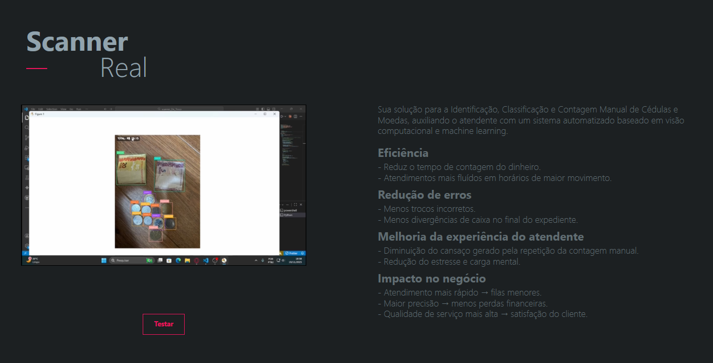
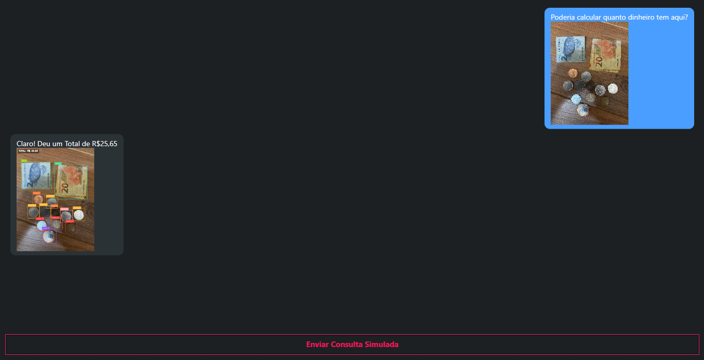

# Scanner Real
- GS 1 de C#

### Problema abordado
No ambiente de atendimento presencial(mercados, padarias, farmácias...) a contagem manual de dinheiro ainda é uma atividade frequente, que envolve algumas dificuldades recorrentes:
- Lentidão na conferência de notas e moedas, especialmente em horários de pico.
- Erros humanos, tanto na identificação dos valores quanto na soma total do pagamento.
- Cansaço físico e mental devido à repetição constante dessa tarefa.

### Importância no contexto do futuro de trabalho
A automação inteligente está transformando a forma como os profissionais desempenham suas atividades. A tendência futura é que:
- Funções repetitivas sejam assistidas ou executadas por sistemas inteligentes;
- Profissionais passem a atuar de forma mais analítica, interpessoal e estratégica, deixando atividades mecânicas para máquinas;
- Pequenos estabelecimentos também adotem ferramentas acessíveis de automação, reduzindo desigualdade tecnológica;
- Tecnologias como visão computacional e machine learning tradicional se tornem tão comuns quanto PDVs e leitores de código de barras.

### Solução
Diante desse cenário, o Scanner Real busca resolver o problema da identificação, classificação e contagem manual de cédulas e moedas, auxiliando o atendente com um sistema automatizado baseado em visão computacional e machine learning. As principais vantagens do projeto são:
- Humanização do trabalho, por retirar do atendente a carga de tarefas cansativas.
- Promover inclusão, ao facilitar e simplificar a contagem de cédulas e moedas.
- Preparar o profissional para novas exigências, onde trabalhar com ferramentas de IA será cada vez mais essencial.

A solução não substitui o atendente, mas amplia suas capacidades e eficiência.

### Resultados e Impactos esperados
Com a implementação do sistema de automatização de identificação, classificação e contagem de notas e moedas, espera-se resultados como:
###### Eficiência
- Redução do tempo de contagem do dinheiro, acelerando o atendimento.
- Atendimentos mais fluídos em horários de maior movimento.
###### Redução de erros
- Menor incidência de troco incorreto.
- Menos divergências de caixa no final do expediente.
###### Melhoria da experiência do atendente
- Redução da carga mental e do estresse.
- Diminuição do cansaço gerado pela repetição constante da contagem manual.
###### Impacto no negócio
- Atendimento mais rápido → filas menores.
- Maior precisão → menos perdas financeiras.
- Qualidade de serviço mais alta → satisfação do cliente.

## Tela Principal

## Tela do Chat

## Participantes
- rm553710 - Gabriel Souza Fiore
- rm552321 - GUILHERME SANTIAGO DA SILVA
- rm553842 - Gustavo Gouvêa Soares
